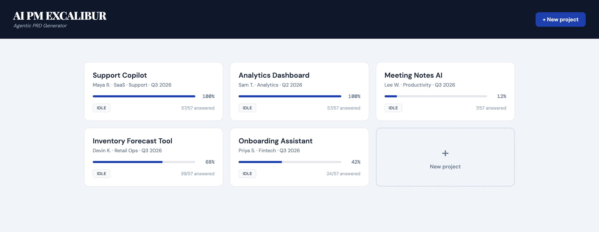

<p align="center">
  
</p>

<h1 align="center">EXCALIBUR</h1>

<p align="center">
  <strong>Agentic PRD Generator</strong><br>
  Paste a paragraph of product context. Get a complete, stakeholder-ready Product
  Requirements Document, written by six specialist AI agents working in sequence.
</p>

<p align="center">
  Runs locally on whatever Claude access you already have —
  API key, subscription, Bedrock, Google Cloud, Foundry, or your company's gateway.
</p>

---

## What it is

Paste in whatever you have — a deck export, an email thread, a one-pager, a transcript — and a pipeline of AI agents turns it into a structured **57-question PRD**. Each agent owns one phase, reads the previous agent's handoff, fills in its slice of the document, and passes a clean packet to the next. A final PM agent reviews the whole thing and produces a consolidated `final-prd.md`.

```
Intake → Discovery → Design → Develop → Deploy → PM Review
```

| Agent | Phase | Owns |
|-------|-------|------|
| **Intake** | Structure raw context | q1–q7 (Market & Business) |
| **Discovery** | Research & opportunity | q8–q16 |
| **Design** | UX & solution shape | q17–q26 |
| **Develop** | Architecture & build | q27–q43 |
| **Deploy** | Launch & GTM | q44–q57 |
| **PM Review** | Consolidate & sense-check | the whole PRD → `final-prd.md` |

Agents keep a lightweight **cross-project memory**: after each run they append a few lessons to a markdown file, which is fed back into their context next time.

It runs as a single local web app — one process, one port, no build step, no database.

<p align="center">
  
</p>

<p align="center"><a href="assets/demo.gif">▶ Watch the 30-second demo</a> (5 MB GIF)</p>

---

## Requirements

- **Python 3.10+**
- The **[Claude Code CLI](https://code.claude.com/docs)** — the SDK bundles it, so `pip install -e .` is usually enough.
- **A Claude credential.** Any of the options below works; none is privileged.

### Providers

Set **one** of these. EXCALIBUR detects which you configured and validates it before a run starts.

| You have | Set | Notes |
|---|---|---|
| An Anthropic API key | `ANTHROPIC_API_KEY` | Billed per token to your Console account |
| A Claude subscription | *(nothing)* — run `claude setup-token` once | Usage counts against your plan, not a bill |
| An LLM gateway | `ANTHROPIC_BASE_URL` + `ANTHROPIC_AUTH_TOKEN` | LiteLLM, Portkey, or your org's proxy |
| Amazon Bedrock | `CLAUDE_CODE_USE_BEDROCK=1` + AWS credentials | |
| Google Cloud | `CLAUDE_CODE_USE_VERTEX=1` + `CLOUD_ML_REGION` + gcloud ADC | |
| Microsoft Foundry | `CLAUDE_CODE_USE_FOUNDRY=1` + Azure credentials | |
| Claude Platform on AWS | `CLAUDE_CODE_USE_ANTHROPIC_AWS=1` + `ANTHROPIC_AWS_WORKSPACE_ID` | |

Check what's detected at any time:

```bash
python tools/auth_preflight.py
```

<details>
<summary><strong>Can I run this on GPT, Gemini, or a local model?</strong></summary>

<br>

Not reliably, and not in a way anyone supports.

EXCALIBUR's agent loop is the Claude Code CLI (via [`claude-agent-sdk`](https://github.com/anthropics/claude-agent-sdk-python)), which owns tool dispatch, the in-process MCP server, and context management. Anthropic's own documentation states they **do not support routing Claude Code to non-Claude models through any gateway**.

Nothing here blocks you from trying: point `ANTHROPIC_BASE_URL` at an Anthropic-format shim such as LiteLLM and it will attempt the call. But know what breaks:

- The **Develop agent depends on the CLI's built-in `WebSearch` tool** to validate current model pricing at q27. Most gateways don't emulate it, so that question silently degrades to unverified claims — and it's one of the most valuable answers in the PRD.
- Tool-calling fidelity varies by model. The agents call up to 8 typed tools per turn and recover poorly from mis-formatted calls.
- Anthropic-specific request fields (`thinking`, `effort`) are rejected outright by some shims.

If you want this genuinely model-agnostic, the honest change is to replace the agent loop rather than proxy it — everything in `tools/` is already provider-neutral Python, and only two blocks in `agents/base.py` touch a model. PRs welcome.

</details>

---

## Install

```bash
git clone https://github.com/Arash-yazdani/excalibur-ai-prd-generator.git
cd excalibur-ai-prd-generator

python3 -m venv .venv
source .venv/bin/activate            # Windows: .venv\Scripts\activate
pip install -e .

cp .env.example .env                 # then set a credential (see Providers above)
python server.py                     # → http://localhost:4500
```

> **One-click launch:** on macOS double-click `start.command`; on Windows `start.bat`. Both create the virtualenv, install dependencies, run the credential preflight, and open the app.

---

## Usage

### Web UI
1. Open **http://localhost:4500**.
2. Create a project and paste your freeform product context. Not sure what that should look like? [`examples/sample-intake.md`](examples/sample-intake.md) is a realistic one — messy notes and an email thread, not a filled-in form.
3. Click **Run** — watch the agents work through the pipeline in real time.
4. Read the generated PRD, handoffs, and artifacts; export the final PRD.

A full run takes roughly **50 minutes**. On a metered credential that's about **$5–12** in tokens; on a subscription it counts against your plan instead.

### Command line
```bash
python orchestrator.py run <project-id>         # full pipeline
python orchestrator.py resume <project-id>      # resume after a pause
python orchestrator.py only design <project-id> # re-run a single agent
python orchestrator.py pause <project-id>       # soft-pause between agents
```

---

## Configuration

All settings are optional — copy `.env.example` to `.env` to change defaults.

| Variable | Default | Purpose |
|----------|---------|---------|
| `PORT` | `4500` | Web server port |
| `PROJECTS_DIR` | `./projects` | Where project JSON files are stored |
| `EXCALIBUR_MODEL` | *(your provider's default)* | Pin a specific model; falls back to `ANTHROPIC_MODEL`. The correct form differs per provider — a model id on the Anthropic API, an inference profile ARN on Bedrock, a version name on Google Cloud, a deployment name on Foundry. |

---

## Project structure

```
excalibur-ai-prd-generator/
├── server.py            # FastAPI app: project CRUD, run control, SSE log stream
├── orchestrator.py      # CLI pipeline runner (run / resume / pause / reflect)
├── agents/              # The six agents (intake, discovery, design, develop, deploy, pm)
│   └── base.py          # Shared agent runtime + the in-process tool surface
├── framework/           # The 57-question framework (questions.json = source of truth)
├── prompts/             # One persona prompt per agent
├── tools/               # Project IO, handoffs, artifacts, run log, memory, credential preflight
├── tests/               # Framework invariants, credential detection, IO safety
├── memory/              # Cross-project lessons (starts empty)
├── static/              # The single-page UI
└── projects/            # Your project files live here (git-ignored)
```

---

## How it works

- **One source of truth.** `framework/questions.json` defines every phase, section, and question. The UI, the agents, and the tests all read from it.
- **Scoped agents.** Each agent can only write the questions it owns; the tool layer rejects out-of-scope writes. The PM agent is the only one allowed to edit across the whole document.
- **Handoff packets.** Between phases an agent writes a structured handoff (summary, decisions, constraints, open risks) that the next agent reads first.
- **Resumable.** Runs pause between agents and resume; completed agents are skipped. State is written to disk per answered question, so a crash at q40 keeps q1–q39.
- **Fails loudly.** A run that produces zero tokens, exhausts its turn budget, or leaves questions blank says so, rather than shipping a plausible-looking but incomplete PRD.

---

## Security

This is a **local, single-user tool**. The server binds to `127.0.0.1` and the API is unauthenticated — that is the whole security model, so don't expose the port. There is deliberately no CORS middleware; `server.py` explains why.

Agent-authored markdown is sanitized before it reaches the browser, because its content derives from whatever you pasted into intake. See [SECURITY.md](SECURITY.md) to report anything security-relevant.

---

## Contributing

Issues and PRs welcome — see [CONTRIBUTING.md](CONTRIBUTING.md). This is a focused, dependency-light codebase: keep changes small, run `ruff check .` and `pytest`, and keep the question framework backwards-compatible.

## License

[MIT](LICENSE).
